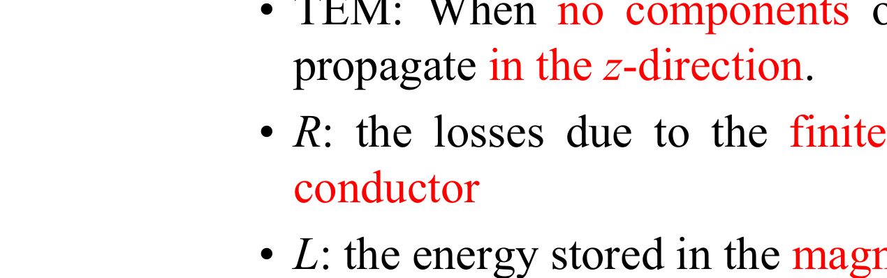

# Ideal Transmission Line Fundamentals

> Source: `chap2_HSDSD.pdf`  
> Instructor: Chun-Long Wang, National Taiwan University of Science and Technology

---

## 2.1 Transmission Line Structures on PCB / MCM *(p.3)*

Two common planar TX line geometries:

| Type | Location | Ground |
|---|---|---|
| **Microstrip** | Outer (surface) layer | Single ground plane below |
| **Stripline** | Inner layer | Ground/power planes above AND below |

- Typical conductor: copper
- Typical dielectric: **FR4** (epoxy-glass composite, $\varepsilon_r \approx 4$–4.5)
- For AC signals: the power plane acts as an **AC ground**.

---

## 2.2 Wave Propagation Concept *(p.4)*

Wave propagation on a TX line is analogous to a waterfront:
- **Voltage** ↔ height of the water
- **Current** ↔ flow of the water

This model is valid when the **rise/fall time is small** compared to the propagation delay down the trace.

---

## 2.3 TX Line Equivalent Circuit *(p.6)*

A TX line is modeled as a distributed RLCG ladder network per unit length (TEM mode assumed):

- **R** (Ω/m): losses from finite conductor conductivity
- **L** (H/m): energy stored in the magnetic field
- **C** (F/m): energy stored in the electric field
- **G** (S/m): losses from finite dielectric resistance

**TEM (Transverse Electromagnetic Mode)**: no E or H field components propagate in the z-direction (propagation direction).

---

## 2.4 Characteristic Impedance *(pp.7–9)*

### General (lossy) formula:

$$Z_0 = \sqrt{\frac{Z}{Y}} = \sqrt{\frac{R + j\omega L}{G + j\omega C}}$$

*(chap2.pdf, p.9)*

### Lossless approximation (valid for most practical TX lines):

$$Z_0 = \sqrt{\frac{L}{C}}$$

*(chap2.pdf, p.9)*

R and G only matter at very high frequencies or very lossy lines.

### Microstrip approximation:

$$Z_0 \approx \frac{87}{\sqrt{\varepsilon_r + 1.41}} \ln\!\left(\frac{5.98H}{0.8W + T}\right) \quad \text{Ohms}$$

*(chap2.pdf, p.9)*  
Valid when $0.1 < W/H < 2.0$ and $1 < \varepsilon_r < 15$. ($W$ = trace width, $H$ = height above ground, $T$ = trace thickness)

### Symmetric Stripline approximation:

$$Z_{0,\text{sym}} \approx \frac{60}{\sqrt{\varepsilon_r}} \ln\!\left(\frac{4H}{0.67\pi(T + 0.8W)}\right) \quad \text{Ohms}$$

*(chap2.pdf, p.10)*  
Valid when $W/H < 0.35$ and $T/H < 0.25$.

For **offset stripline** (trace not centered between planes), use the harmonic mean of two symmetric stripline values at heights $A$ and $B$:

$$Z_{0,\text{offset}} \approx 2 \cdot \frac{Z_{0,\text{sym}}(2A,W,T,\varepsilon_r) \cdot Z_{0,\text{sym}}(2B,W,T,\varepsilon_r)}{Z_{0,\text{sym}}(2A,W,T,\varepsilon_r) + Z_{0,\text{sym}}(2B,W,T,\varepsilon_r)}$$

*(chap2.pdf, p.10)*

---

## 2.5 Propagation Velocity and Time Delay *(pp.11–12)*

$$v = \frac{c}{\sqrt{\varepsilon_r}}$$

$$\text{PD} = \frac{1}{v} = \frac{\sqrt{\varepsilon_r}}{c}$$

$$\text{TD} = \frac{x\sqrt{\varepsilon_r}}{c}$$

*(chap2.pdf, p.11)*

where $c = 3 \times 10^8$ m/s, $x$ = line length, $\varepsilon_r$ = dielectric constant.

**Alternate form** using distributed parameters:

$$\text{TD} = \sqrt{LC}, \quad \text{PD} = \sqrt{L_{\text{unit}} C_{\text{unit}}}$$

*(chap2.pdf, p.11)*

### Effective dielectric constant for microstrip:

$$\varepsilon_e = \frac{\varepsilon_r + 1}{2} + \frac{\varepsilon_r - 1}{2}\left(1 + \frac{12H}{W}\right)^{-1/2} + F - 0.217(\varepsilon_r - 1)\frac{T}{\sqrt{WH}}$$

*(chap2.pdf, p.12)*

where:
$$F = \begin{cases} 0.02(\varepsilon_r - 1)\!\left(1 - \frac{W}{H}\right)^2 & \text{for } W/H < 1 \\ 0 & \text{for } W/H > 1 \end{cases}$$

**Comparison:** On the same FR4 board, stripline has a **larger** effective $\varepsilon_r$ (slower, larger TD), while microstrip has a **smaller** effective $\varepsilon_r$ (faster, smaller TD).

---

## 2.6 SPICE Equivalent Circuit Models *(pp.13–14)*

A TX line cannot be modeled with infinite elements; use enough segments based on minimum rise/fall time:

$$\text{segments} \geq 10\left(\frac{x/v}{T_r}\right) = 10\left(\frac{\text{TD}}{T_r}\right)$$

*(chap2.pdf, p.14)*

Circuit parameters per segment:

$$C_{\text{seg}} = \frac{x \cdot C/\text{meter}}{\text{segments}}, \quad L_{\text{seg}} = \frac{x \cdot L/\text{meter}}{\text{segments}}$$

$$\text{TD}_{\text{seg}} = \sqrt{L_{\text{seg}} C_{\text{seg}}} \leq \frac{T_r}{10}$$

*(chap2.pdf, p.14)*

### Example 2.1 — Creating a TX Line Model *(pp.15–16)*

Given: $Z_0 = 50\,\Omega$, $x = 5$ in., $\tau_r = 2.5$ ns, $\varepsilon_r = 4.5$, stripline geometry ($W=5$ mil, $T=0.7$ mil, $H=14.7$ mil).

$$\text{TD} = 5\text{ in.} \times 0.0254\text{ m/in.} \times \frac{\sqrt{4.5}}{3\times10^8\text{ m/s}} = 898\text{ ps}$$

$$L_{\text{total}} = \text{TD} \times Z_0 = 898 \times 10^{-12} \times 50 = 44.9\text{ nH}$$

$$C_{\text{total}} = \frac{\text{TD}}{Z_0} = \frac{898 \times 10^{-12}}{50} = 17.9\text{ pF}$$

Segments needed: $10 \times \frac{5\text{ in.} \times 0.0254}{2.5\text{ ns} \times 1.41 \times 10^8} = 3.6 \to$ use **4 segments**

$$C_{\text{seg}} = 17.9/4 = 4.48\text{ pF}, \quad L_{\text{seg}} = 44.9/4 = 11.23\text{ nH}$$

*(chap2.pdf, pp.15–16)*

---

## 2.7 Launching an Initial Wave *(p.17)*

When a source $V_s$ with source impedance $Z_s$ drives a TX line of impedance $Z_0$, the initial (incident) voltage is set by a voltage divider:

$$V_i = V_s \frac{Z_0}{Z_0 + Z_s}$$

*(chap2.pdf, p.17)*

When $Z_L = Z_0$ (matched): $V_i$ is the DC steady-state value — no reflections.

---

## 2.8 Reflection Coefficient *(p.18)*

At any **junction** (impedance discontinuity):

$$\rho = \frac{V_{\text{reflected}}}{V_{\text{incident}}} = \frac{Z_t - Z_0}{Z_t + Z_0}$$

*(chap2.pdf, p.18)*

Special cases:
- **Matched** ($Z_t = Z_0$): $\rho = 0$
- **Short** ($Z_t = 0$): $\rho = -1$
- **Open** ($Z_t = \infty$): $\rho = +1$

Reflections continue bouncing back and forth (counter-reflections) until steady state is reached.

---

## 2.9 Lattice (Bounce) Diagrams *(pp.20–21)*

A bounce diagram tracks wave amplitude vs. time:
- Diagonal lines = waves traveling on the line
- Time increases downward
- Each time step = TD (one-way propagation delay)
- At each end, multiply by the reflection coefficient at that end

**Overdriven** ($Z_0 > Z_s$): initial $V_i > V_{ss}$ → ringing above steady state.  
**Underdriven** ($Z_0 < Z_s$): initial $V_i < V_{ss}$ → signal rises gradually to steady state.

Rise time effect: if $\tau_r > 2\text{TD}$, reflections arrive during the rise transition — waveform distortion (ledges, glitches) occur. *(p.27)*

---

## 2.10 Reflections from Reactive Loads *(pp.28–30)*

### Capacitive load (no loss):
- Capacitor initially looks like a **short** ($\rho = -1$), later like an **open** ($\rho = +1$).
- Adding $C_L$ slows down the data rate; signal at load has a time constant dependent on $C_L$.

### Capacitive load (lossy — parallel $R_L C_L$):
With $Z_s = Z_0$, time constant = $C_L \times (R_L \| Z_0)$. Adding $R_L$ makes $\tau$ smaller (faster settling). *(p.29)*

### Inductive load:
- Inductor initially looks like an **open** ($\rho = +1$), then discharges with time constant $\tau = L/Z_0$.
- Produces a spike at $t = 2\text{TD}$. *(p.30)*

---

## 2.11 Termination Schemes *(pp.31–36)*

### Goal: match the impedance to eliminate reflections.

| Method | How | Pros | Cons |
|---|---|---|---|
| **On-die source** | I-V curve of output buffer ≈ $Z_0$ | No extra components | Difficult to achieve; varies with process/voltage/temp |
| **Series source** | Add $R_s$ in series so $R_s + Z_{\text{driver}} = Z_0$ | Small total variation | Extra resistor cost/area |
| **Load (parallel)** | $R_L = Z_0$ at load end | Low-impedance buffers OK | DC current draw → power/thermal issues |
| **AC load** | Series $R=Z_0$, $C_L$ at load; $RC \approx 1$–$2\tau_r$ | No DC dissipation | Increases signal delay; extra components |

**AC termination**: $R = Z_0$, $R C_L = 1 \sim 2\tau_r$ *(p.35)*

**Line length guidelines** *(p.36)*:
- **Short lines** → source termination preferred (preserve DC levels)
- **Long lines** → load termination preferred (prevent reflections traveling back)

---

## 2.12 Bergeron Diagrams *(pp.25–26)*

Used when nonlinear sources/loads are present. Solve graphically:
1. Plot the source I-V line (slope $= -1/Z_0$, passing through $(V_s, 0)$).
2. Plot the load I-V curve.
3. Intersection = operating point of the incident wave.
4. Repeat for reflected waves.

---

## 2.13 Additional Example — 50 Ω Microstrip Design *(pp.37–43)*

Given: $Z_s = 30\,\Omega$, edge rate = 100 ps, swing 0→2 V, $Z_0 = 50\,\Omega$, $x = 5$ in., $\varepsilon_r = 4.0$, microstrip.

**Key results:**
- Trace geometry: $T = 1.0$ mil, $W = 5$ mil, $H = 3.2$ mil (approximated from $Z_0$ formula)
- $\varepsilon_e$: since $W/H > 1$, $F = 0$
- Propagation velocity computed from $\varepsilon_e$, then $\text{TD} = x/v$
- Minimum 72 segments required
- $L$ and $C$ per segment computed from total $L_{\text{total}} = \text{TD} \times Z_0$ and $C_{\text{total}} = \text{TD}/Z_0$

*(chap2.pdf, pp.39–43)*
